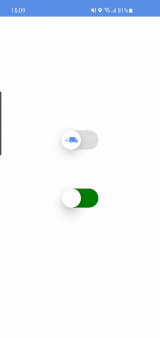

# Switch

A switch component powered by Reanimated v2.
Native animations, color interpolation + supports press and swipe.

[](https://badge.fury.io/js/react-native-reanimated2-switch)
[](https://www.npmjs.com/package/react-native-reanimated2-switch)

### Demo



### Installing

```Shell
npm i -s react-native-reanimated react-native-reanimated2-switch
```

### Usage

```js
import Switch from "react-native-reanimated2-switch"
```

```js
<Switch
  activeBackgroundColor='blue' 
  inactiveBackgroundColor='green'
/>
```

### Props

| Prop                       | Type                    | Default             | Required | Note                                                                             |
| -------------------------  | ----------------------- | --------------------| -------- | -------------------------------------------------------------------------------- |
| value                      | bool                    | false               | false    | Initial switch state                                                             |
| onChange                   | function                | (newValue) => {}    | false    | Callback called when switch value is changed                                     |
| inactiveBackgroundColor    | string                  | green               | false    | background color when inactive                                                   |
| activeBackgroundColor      | string                  | red                 | false    | background color when active                                                     |
| inactiveIcon               | component               | null                | false    | Component shown in the circle when inactive. Useful for images for example       |
| activeIcon                 | component               | null                | false    | Component shown in the circle when active. Useful for images for example         |
| containerStyle             | object                  | {}                  | false    | Optional style object for container                                              |
### Authors

- Alaa Ben El Ahmar - [Alaa-Ben](https://github.com/Alaa-Ben)
### Contribute

Contributions are always welcome! Create a new Pull Request
